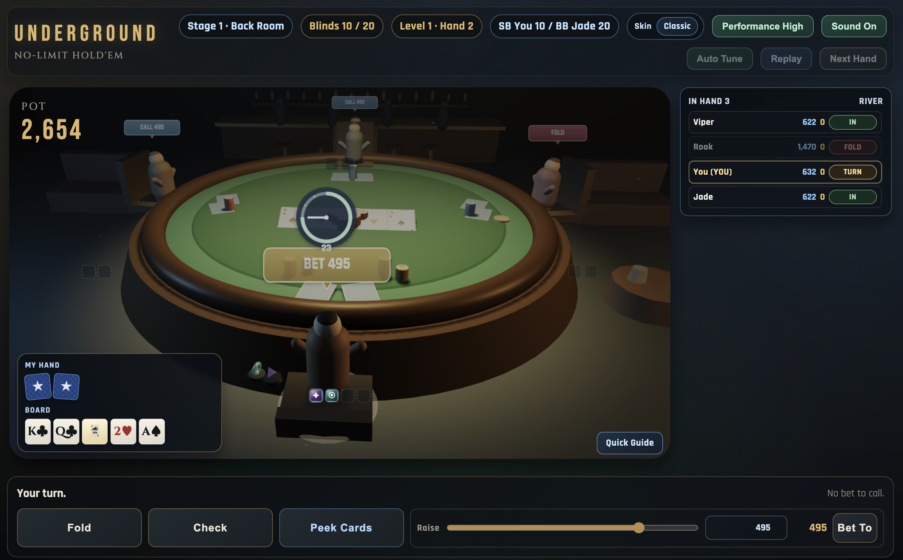

# Underground Hold'em

3D 텍사스 홀덤 웹 게임.

## 게임 화면

## 플레이 주소

- [https://texasholdem.freefree9758.workers.dev/](https://texasholdem.freefree9758.workers.dev/)

## 빠른 가이드

1. 홈 화면에서 `Start Game` 클릭
2. 내 턴에 `Fold / Check(Call) / Raise` 중 선택
3. `Peek Cards`(또는 `P` 홀드)로 내 카드 확인
4. 아이템은 내 슬롯 클릭으로 사용, `Shift+클릭`/`우클릭`으로 판매
5. NPC 3명을 파산시키면 스테이지 클리어

## 조작 키

- `F`: Fold
- `C`: Check / Call
- `R`: Raise
- `P`: Peek Cards (홀드)
- `N`: Next Hand
- `H`: Replay
